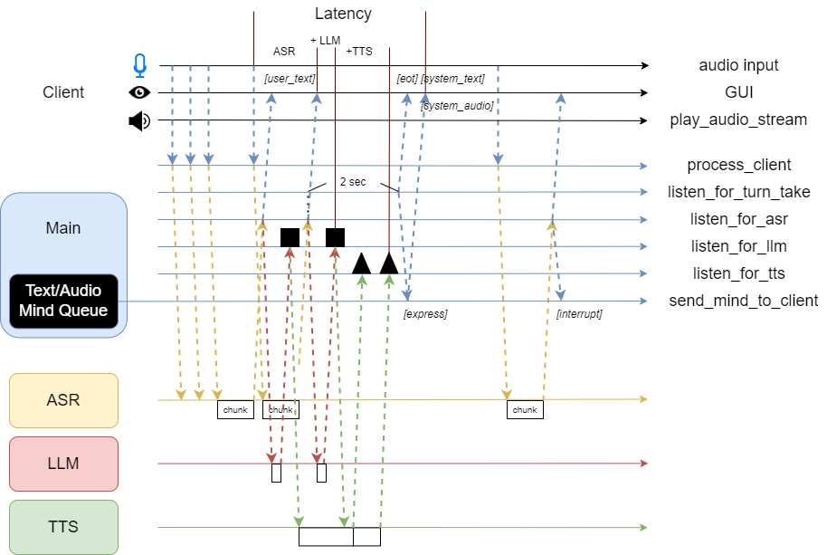
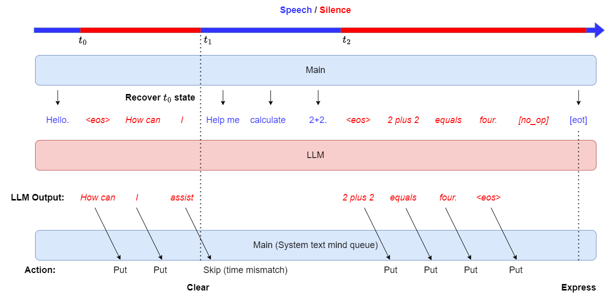
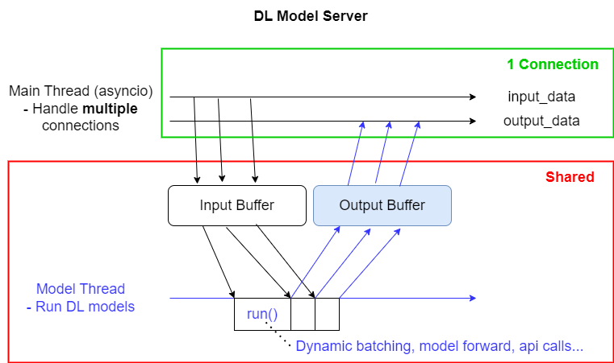

# SpeechChatGPTStreaming

This system was jointly developed by Wei-Ping Huang, En-Pei Hu, Tzu-Quan Lin and Liang-Hsuan Tseng from the Speech Processing and Machine Learning Lab at National Taiwan University.

## System

#### Flow
Introduce **mind queue** mechanism.


#### Streaming LLM


#### Deep Learning Server


## Server
Create server by a tag. For all tags, see `server/load.py`
```
python3 start_server.py -n [tag]
```
- ASR tags: `whisper`
- LLM tags: `gpt`, `slm`, `slm-trt`(require tensorRT engine)
- TTS tags: `tts`(=`openai-tts`), `openai-tts`, `google-tts`
- Speech to units tags: `streaming-hubert-discrete`
- Vocoder tags: `voc-old`, `voc`, `voc-diffusion`
- Web backend server tags: `client`

### Cascade API
Run `whisper`, `gpt`, `tts` subservers first.

Then run the corresponding main server:
```
python3 start_server.py -n main-api -h HOST -p PORT
```

### Our Pipeline
For Whisper + Hubert unit + Spoken Llama + Unit vocoder, run `whisper`, `streaming-hubert-discrete`, `slm-v0`, `voc` subservers first.

For Taipei-1 models, run `whisper`, `streaming-hubert-discrete`, `slm`, `voc-diffusion` subservers first.

Then run the corresponding main server:
```
python3 start_server.py -n main -h HOST -p PORT
```

If you want to test ASR only, use
```
python3 start_server.py -n main -h HOST -p PORT --debug asr
```
If you want to test ASR + LLM only, use
```
python3 start_server.py -n main -h HOST -p PORT --debug llm
```

Currently the default configuration for each subserver is hardcoded in `server/*/config.yaml`, so setting custom host/port from the command line is only available for the main servers.

## app

Modify the `SERVER_IP` and `SERVER_PORT` in `app.py`.
After running all servers, run
```
python3 app.py
```

#### Usage
- Make sure all servers are **operating correctly** before running the client.
- By input "===" in the textbox you can clear the chat history.

## Website

Modify the `host`, `port` in `server/Client/config.yaml`

### Demo Website
[SLM Arena](https://slmarena.ntuspeechlab.com/)

### Backend
```
python3 start_server.py -n client
```
### Frontend

Please follow the repo [sarena](https://github.com/andybi7676/sarena) to setup
```
git clone https://github.com/andybi7676/sarena.git
cd sarena
yarn install
yarn start
```


## Issues

#### IO device setting
Set your **device index** in app.py for input and client/audio_stream.py for output. This is a script to check the indices.
```
import pyaudio
import sounddevice as sd

# List devices with PyAudio
p = pyaudio.PyAudio()
for i in range(p.get_device_count()):
    info = p.get_device_info_by_index(i)
    print(f"PyAudio Device {i}: {info['name']}")

# List devices with sounddevice
print(sd.query_devices())
```

#### Bad input quality

By input "===" in the textbox, main server dumps the audio stream received into _data/client.wav. Hallucinations are sometimes caused by bad audio input, and one can identify the issue by checking this .wav file. Currently some known issues on `app.py` are

- Interference with output channel
- Very noisy input

We've tested on different commonly used devices:
- Separate microphone and earphone devices(v)
- Airpod(v)
- Earphone(x)
- Headphone(x)
- Macbook build-in devices(x)

Fortunately, using WebUI will avoid the interference problem.
